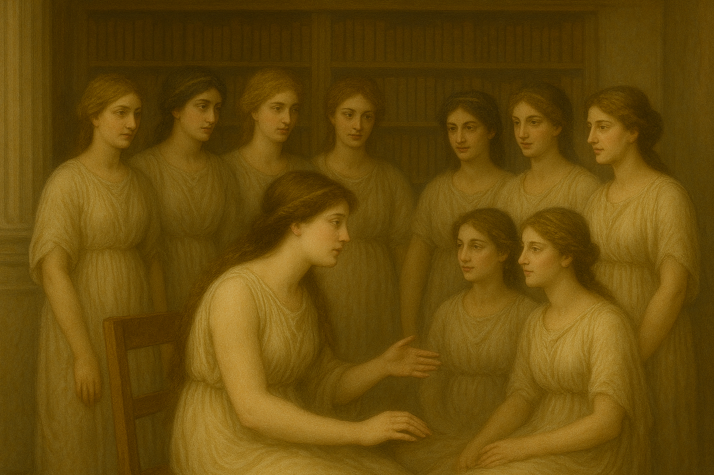

    

# Mnemosyne, an integrated assistant for qualitative research

[Mnemosyne](https://en.wikipedia.org/wiki/Mnemosyne) is the goddess of memory and is the mother of the 9 muses for creativity. 
This project aims to create a modular, integrated assistant for qualitative research where each resercher is a large language model
idependenltly deciding on its own research questions.

## Literature Module

## Researcher Module

## Knowledge Base Module

## Project Meta Module

## Usage
