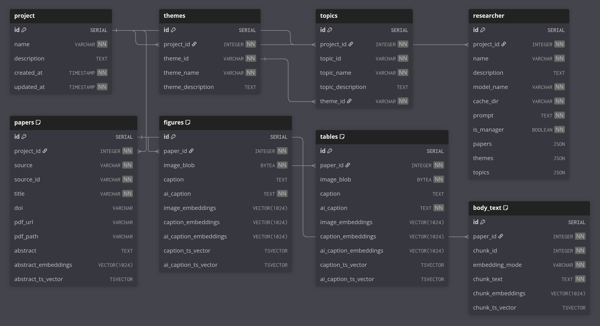

# Knowledgebase Module

This module represents the database that stores all the informations related to the project. The database is built using the 
[SQLAlchemy](https://www.sqlalchemy.org/) ORM, on top of a PostgreSQL database. Storing all the data including all the literature
searches allows the LLMs to have an easy access to the information and creates a more effiecent platform that also promotes
the reproducibility of the results.

Geneartion of the database is not somethign that end user needs to worry about, but it is something that is done automatically
by the Project meta class but for the sake of completeness it is described here.

## Database Schema

Below is the complete database schema with descriptions of some of the tables and columns:

### Schema

## Some important tables and columns that are used in the project

### Researcher

This table described the researchers (the LLMs) that are part of the project. The prompt column
includes the main prompt for the model that has placeholders for the themes, topics and papers that also become
part of the prompt when the model is called. This table does not store the actual LLM model weights but only inlcudes the 
`cache_dir` if the model is a local one. If this is a closed source model like ChatGPT then the `cache_dir` is not included but
insead you can specify the url to the model. I am not storing the api keys in the database for security reasons.

### Paper

This tables stores all the data that is extracted (or not, you can leave most of the columns empty) from the papers. The
information extracted is described in the literature module [readme](literature.md). 

As mentioned the end user is not expected to interact with the database directly but it is the job of the Project meta class
to generate the database and add information as it becomes available.

